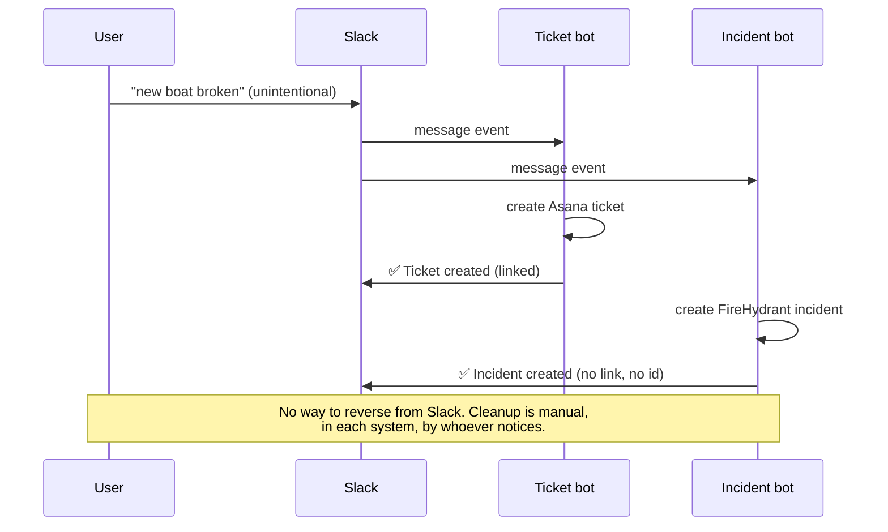
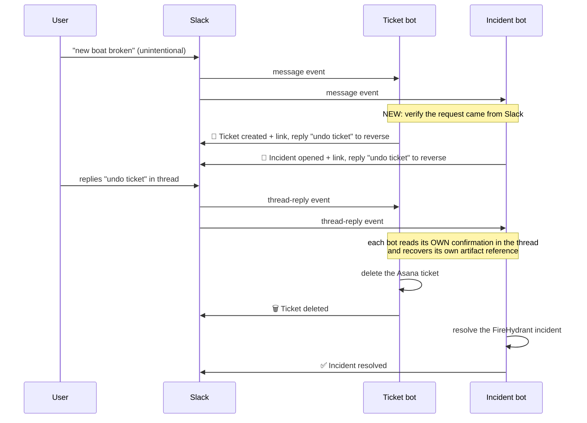

# Undo for the Slack Command Bots

*Technical specification. Arc Boat Company take-home.*

## Context

**Original request:** A coworker activated the Slack bot unintentionally, creating an extra Asana ticket. They asked for an undo feature, typing `undo` to reverse the previous command.

**Current setup:** a single streaming AWS Lambda in TypeScript, hosting three Slack apps routed by path, with secrets in AWS Secrets Manager.

| Bot | Fires on | Creates | Confirmation today |
| --- | --- | --- | --- |
| Ticket bot | `^new (.*)` | an Asana task | checkmark + **linked** ticket |
| Incident bot | `^new (.*)` | a FireHydrant incident | checkmark only, **no link, no id** |
| Pager bot | `^page (.*)` | a PagerDuty page | checkmark + confirmation |

Each bot receives every message in the public channels it's installed in and pattern-matches the raw text. Nothing is stored, so **the bot's reply is the only record that anything happened.**

**The tradeoff today:** the design is frictionless: someone states a problem in the words they'd use anyway and a ticket exists, with nothing to learn. But both the ticket and incident bots fire on any message beginning with "new," so "New plan is to ship Friday" is indistinguishable from a request, and nobody can undo what fires unintentionally.

**The fact that shapes the whole design:** the ticket and incident bots are **two entirely separate Slack applications**, each receiving its own copy of every message and unable to see the other's replies. A Slack app only receives messages from **channels its bot was added to**, so one "new" message produces **one artifact or two depending on which bots were installed there**, decided once and invisibly by whoever set up the channel.

## Problem

To reverse a command you must know what it created, and today that is unknowable from the message alone.

1. **Nothing can be reversed from where the mistake happened.**
2. **The trigger cannot tell a command from a sentence.** The coworker didn't misuse the tool; the tool has no concept of being invoked.

**Status quo:** cleanup is manual, in each system separately, by whoever notices, and assumes the user has Asana access and knows a second artifact may exist in FireHydrant.

## Decision we need to make first

**Should one message create both a ticket and an incident?**

Two separate questions, often conflated:

1. **Was the coupling intentional?**
2. **Do we want it to continue working this way?**

| | Branch A: they belong together *(recommended)* | Branch B: keep them separate, or merge not approved |
| --- | --- | --- |
| **Structural change** | Merge the two bots into one application | None |
| **Relationship to undo** | Prerequisite, merge first then undo | None, undo ships as-is |
| **What undo looks like** | One record, one reversal, one reply | Each bot reverses its own artifact, replies separately |
| **Pros** | One legible outcome per input; fan-out becomes deliberate and visible | Ships immediately; no migration risk |
| **Cons** | ~1 day plus migration coordination first | Blast radius stays invisible; the real defect goes unfixed |

**Branch A is recommended:** one input producing one reversible outcome is what users already believe they have. Undo ships either way; only its shape changes.

## Proposed Solution

**Reply `undo ticket` in the thread, and what that command created is reversed.**

### How it works

1. A user replies **`undo ticket`** in the thread under the bot's confirmation. Anyone in the thread may do this.
2. Each bot present looks for **its own** confirmation message in that thread.
3. If it finds one, it recovers the reference and reverses it. If it finds none, it stays quiet.
4. Each bot that acted replies with what it did.

No coordination between bots is required or possible: each reads only its own record, so if only the ticket bot is installed only the ticket is reversed. Safety comes from the phrase rather than permissions, since "undo ticket" is unlikely to come up conversationally, whereas a bare "undo" would recreate the accident this feature exists to fix.

### What the bot says

An incident is *resolved*, not deleted, because incidents can't be un-created.

| Moment | Reply |
| --- | --- |
| Ticket created | 🎫 Ticket created: *link*. Reply **undo ticket** to reverse. |
| Incident opened | 🚨 Incident opened: *link*. Reply **undo ticket** to reverse. |
| Undo, ticket | 🗑️ Ticket deleted. |
| Undo, incident | ✅ Incident resolved. |
| Undo, already done | Already undone, nothing left to reverse. |
| Reversal failed | ⚠️ Couldn't reverse this: *reason*. Nothing else was changed. |
| Bare "undo" | Did you mean to reverse this? Reply **undo ticket** to confirm. |
| Nothing to undo | Nothing here to undo. I can't find my confirmation in this thread. |

### Two prerequisites

1. **Put an id and link in the incident bot's confirmation**, which today leaves undo nothing to act on. It also shows users what one message actually created.
2. **Verify that incoming webhooks come from Slack.** The endpoint is a public URL, and that risk changes once a command can delete.

## Key Design Choices

**Nothing new is introduced.**

- **Persistence:** none. The Slack thread is the system of record: it already holds who asked, what was created, and where it lives.
- **Hosting and integrations:** the existing Lambda, function URL, and deploy, calling only the three services the bots already call. No new services, queues, or automation platform. The one addition is a signing secret alongside the bot tokens already in Secrets Manager.
- **Language and libraries:** TypeScript and the existing parsing schemas and injected clients, with no new dependency.
- **Pattern and tests:** extends the existing handler shape and fake-client test pattern rather than adding a framework.

**Reliability**

Slack guarantees at-least-once delivery, so any handler must assume it will run twice. The two defenses are remembering which events you've seen, which needs storage, or making the operation safe to repeat, which doesn't.

- **Undo takes the second:** reversing something already reversed fails harmlessly and reports "already undone." Creation takes neither today, which is why duplicate tickets on retry remain possible.
- **Partial failure is expected.** The bots reverse independently, so each reports its own outcome and a failure in one never rolls back the other.

## Key Details / Flows

### Current flow

### Proposed flow

## Alternatives Considered

- **Splitting ticket and incident into separate commands.** Ends the double reply, but asks someone to classify a problem's severity while reporting it. The goal is to minimize the decisions a user makes, not add one.
- **A database journal of every action.** Prevents duplicate creates on retry, a bug this release doesn't fix anyway, and fail-safe reversal already covers undo.
- **Shipping the trigger fix instead of undo.** Does nothing for the ticket already created or the next genuine mistake, and trades a loud failure for a silent one.

## Follow-ups

Deferred, in order of least disruption:

1. **Confirmation step before creating.** Prevention rather than repair, with no configuration change. Not in this release because it adds a step to every legitimate use, which is a product call.
2. **Buttons on the confirmation, and emoji reactions.** Both bind the action to the artifact instead of a phrase, and both need a Slack app-config change plus a new verified endpoint, so that plumbing is worth building once.
3. **Narrow the trigger** from "new" to "new ticket," then slash commands. Accept both phrasings during migration and announce a sunset date, with the deprecation notice private to whoever used the old form.

## Effort

Implementation time for one engineer, with AI assistance. Review, deploy, and provisioning the signing secret sit on top.

- **This release: 1-2 days**, with the enriched confirmations and webhook verification about an hour each. Merging the bots, if Branch A, adds a day plus migration coordination.
- The follow-ups are half a day to a day each, apart from the trigger narrowing at about two hours.

## Out of Scope

- **PagerDuty pages**, since paging has its own deliberate command and isn't part of this accident.
- **An undo stack or redo.** Reversing both a ticket and an incident with one command is in scope; walking back through history is not.
- **Undo as a fresh channel message**, which reintroduces the ambiguity thread-scoping removes.

## Known Limitations

- **Deleted tickets land in the bot's trash, not the user's**, since the bots act as one identity. Recovery runs through whoever administers that account.
